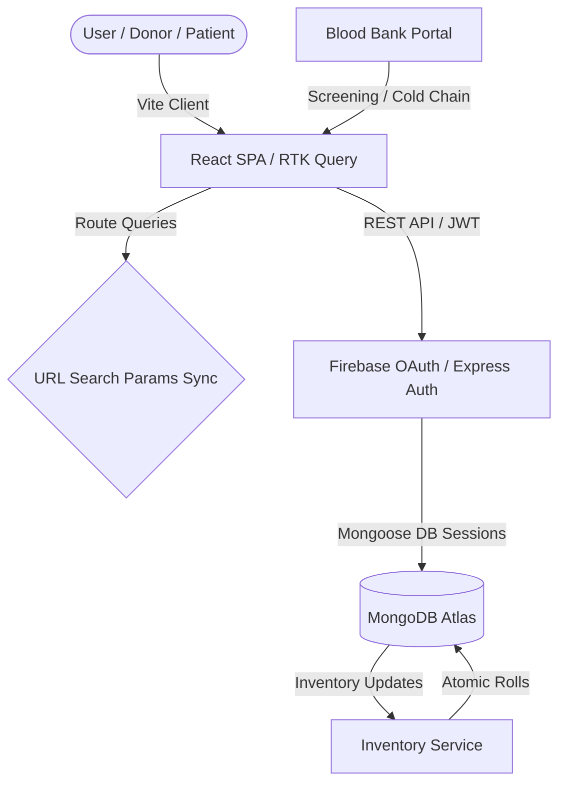

<div align="center">

# 🩸 RaktSarthi

### Real-Time Blood Management System & Intelligent Logistics Engine

*A secure, high-performance, and reactive ecosystem designed to connect donors, patients, and blood banks seamlessly, ensuring critical supply chain reliability.*

[](https://reactjs.org/)
[](https://nodejs.org/)
[](https://www.mongodb.com/)
[](https://redux-toolkit.js.org/)

[Core Capabilities](#-core-capabilities) • [Technical Architecture](#%EF%B8%8F-technical-architecture) • [Security & Performance](#-security--performance-standards) • [Developer Setup](#-installation--setup) • [Contributing](#-contributing)

</div>

---

> [!IMPORTANT]
> **RaktSarthi** (Blood Companion) is not just a directory—it is a mission-critical logistics engine. In medical emergencies where seconds decide lives, RaktSarthi enforces real-time synchronization, cold-chain compliance, and absolute data integrity to deliver blood safely where it is needed most.

---

## 🚀 Core Capabilities

### 🏢 Specialized Blood Bank Logistics
* **Adaptive Multi-Update Screening**: Ensures quarantined refined units can be repeatedly updated/screened. Status alterations (e.g., failed screening post-entry) automatically trigger atomic inventory rollbacks, ensuring zero phantom supply.
* **Granular Inventory Splitting**: Allows blood banks to partition whole blood units into specialized components (RBCs, Plasma, Platelets, Cryoprecipitate) with isolated expiry clocks.
* **Continuous Cold Chain Monitoring**: Log temperature changes per unit to ensure storage conditions remain within strict clinical limits.
* **Stateful Discard Registry**: Detailed audit trail for discarded units documenting testing admin, date, and reasons (e.g. positive tests for HIV/HBV/HCV/Syphilis/Malaria).

### 🩸 Engaging Donor Ecosystem
* **Smart Eligibility Engine**: Automates weight, age, and temporal interval validations (56-day cooldown) along with complex health questionnaire audits.
* **Interactive Blood Camps**: Search, register, and track scheduled camps and public events with real-time location mapping.
* **Dynamic Mode Toggling**: Instantly swap between Donor Profile and Patient/Recipient views.

### 🏥 High-Priority Recipient Sourcing
* **Location-Aware Matching**: Find compatible donors by blood group and proximity using intelligent geo-spatial indexing.
* **Priority Request Pipeline**: Urgent and emergency blood requests are broadcast instantly with real-time status and matching indicators.

---

## 🛠️ Technical Architecture

### Tech Stack
* **Frontend**: React 18.2, Redux Toolkit (RTK) Query for robust data caching & invalidation, React Router 6.
* **Backend**: Node.js, Express, Mongoose ORM, WebSocket (Socket.io) for instant notifications.
* **Storage & Hosting**: MongoDB Atlas (Primary Database), Firebase Authentication (Google OAuth Integration).

### Architecture Highlights
* **State-Preserving URL Routing**: Dashboard sub-tabs (`tab`, `inv_tab`, `comp_tab`) are fully synchronized to URL parameters. Page refreshes maintain exact views, while dead states are scrubbed automatically.
* **Atomic Transactions**: All inventory mutations (additions, splits, screening updates) run in isolated Mongoose database sessions (`startTransaction`), ensuring absolute ACID compliance under high concurrency.
* **Namespace-based Services**: Wildcard namespace service loading standards to decouple logical workflows and decrease bundle debt.



---

## 🔒 Security & Performance Standards

* **ACID Integrity**: Enforced database sessions with auto-abort features on transaction error.
* **Secure Payloads**: Automatic MongoDB Injection protection (`mongoSanitize`) on all POST/PUT requests.
* **Strict Privacy Rules**: No exposure of `.env` assets or credentials in repository histories.
* **Helmet & CORS**: Hardened HTTP security headers and precise origin white-listing.
* **Sub-500ms API Execution**: Aggregation pipelines optimized using high-efficiency indexing and parallelized `Promise.all` queries.

---

## 📁 Project Layout

```
RaktSarthi/
├── backend/                          # Node.js Server & APIs
│   ├── config/                       # DB and core settings
│   ├── controller/                   # Request controllers
│   ├── middleware/                   # JWT & Payload sanitization
│   ├── models/                       # Schema definitions
│   ├── repositories/                 # Data access layer
│   ├── routes/                       # Router directories
│   └── services/                     # Business logic layers (BloodUnit, Inventory, Camps)
├── frontend/                         # Vite / React Application
│   ├── src/
│   │   ├── components/               # Reusable modules (Sidebar, Modals)
│   │   ├── context/                  # Auth Context
│   │   ├── enum/                     # Centralized Route Paths
│   │   ├── pages/                    # Dynamic Pages (Tracking, Dashboard, Donors)
│   │   ├── pages.css/                # Aesthetic CSS tokens
│   │   └── store/                    # RTK Query API slices
└── README.md                         # Noble Cause Documentation
```

---

## 📦 Installation & Setup

### Prerequisites
* Node.js (v18 or higher)
* MongoDB Atlas cluster
* Firebase Account

### 1. Clone & Install
```bash
git clone https://github.com/yourusername/RaktSarthi.git
cd RaktSarthi
```

### 2. Configure Backend
Create `backend/.env`:
```env
PORT=5001
NODE_ENV=development
MONGODB_URI=your_mongodb_connection_string
JWT_SECRET=your_base64_jwt_secret
JWT_EXPIRE=7d
CORS_ORIGIN=http://localhost:3000
```
Run installation:
```bash
cd backend
npm install
npm run dev
```

### 3. Configure Frontend
Create `frontend/.env`:
```env
REACT_APP_API_URL=http://localhost:5001/api
```
Update your Firebase configuration in [firebase.jsx](file:///c:/Users/disha/Desktop/bloodbank-main/frontend/src/config/firebase.jsx).
Run installation:
```bash
cd ../frontend
npm install
npm start
```
Go to `http://localhost:3000` to access RaktSarthi.

---

## 🤝 Contributing

We welcome contributions to this noble cause. Please ensure:
1. All changes respect clean separation of concerns.
2. Code follows our Tailwind-free Vanilla CSS design parameters for structural simplicity.
3. Commit messages are atomic and highly descriptive.

---

<div align="center">

### ⭐ Support RaktSarthi by starring the repository!

*Save Lives, Donate Blood.* 🩸

</div>
